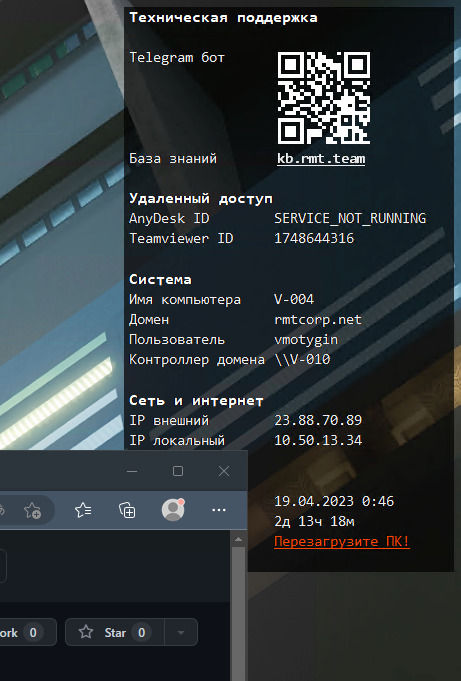

# rmt-desktopinfo
Конфигурационный файл и скрипты для Desktopinfo, программы отображающей системную информацию на экране компьютера.

Умеет выводить ID Teamviewer и Anydesk, отображать предупреждение, если компьютер давно не перезагружался и прочую системную информацию.
Нахардкожено в обнимку с ChatGPT, потому просьба сильно не пинать.

Сайт программы https://www.glenn.delahoy.com/desktopinfo/

QR-код можно сгенерировать тут https://www.the-qrcode-generator.com

Главное "окно" программы

