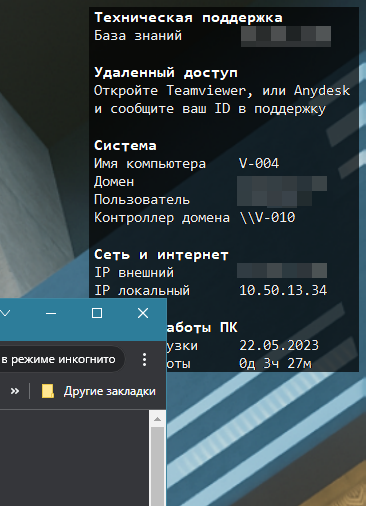

# rmt-desktopinfo
Конфигурационный файл и скрипты для Desktopinfo, программы отображающей системную информацию на экране компьютера.

Умеет выводить ID Teamviewer и Anydesk, отображать предупреждения, если компьютер давно не перезагружался и прочую системную информацию.

